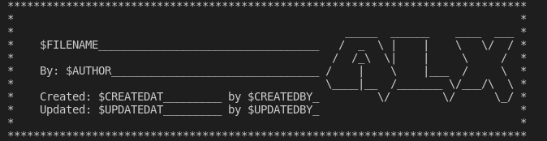
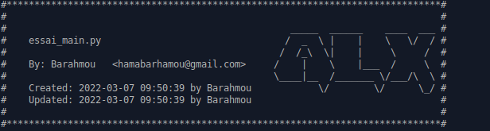

# ALX-Header
project to create a header for an ALX file 



For ALX students, but customizable for all other students. </br>
This project aims to insert the above header in all our files whatever the language. </br>
The work is currently in progress and the code is quite intuitive. Any contribution is welcome. </br>
If you like to participate, I invite you to make a fork of the project. </br>
Try to understand the project by yourself the time for me to write the **contribute.me** file that </br>will explain how you can contribute to the project. See you soon partner

## Installation
***
A little intro about the installation.
```
sudo apt-get install inotify-tools
$ git clone https://github.com/HamaBarhamou/ALX-Header.git

```
fill in the ```user_name``` and ```user_email``` fields in the ```user_config.json file```

## Example of use

```
$ cd ALX-Header
$ ./ALX-Header.sh file_name.sh # file_name.c or file_name.py ....

```


## Expected result 




